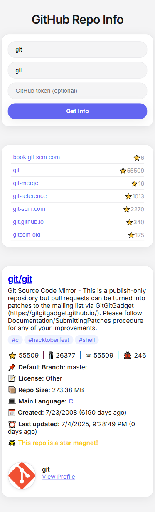

# GitHub Repo Info Tool

A simple, user-friendly web app to search any GitHub user's repositories, filter by name, and view detailed info about each repo—all in a clean, responsive interface.

## Features

- 🔍 Search for any GitHub username and list all their public repositories
- 📝 Filter repositories by name as you type
- 📦 View detailed info for each repo: description, topics, stars, forks, watchers, open issues, license, size, main language, creation date, last update, and more
- 🌐 Direct links to the repo, homepage, and owner profile
- 📱 Fully responsive and mobile-friendly design
- 🔑 Optional GitHub token support to avoid API rate limits

## Getting Started

1. **Clone this repository:**
   ```bash
   git clone https://github.com/your-username/github-repo-info-tool.git
   cd github-repo-info-tool
   ```
2. **Open `index.html` in your browser.**
   - No build step or dependencies required.

## Usage

- Enter a GitHub username to load their repositories.
- Optionally, enter a personal access token to increase API rate limits.
- Filter repos by typing in the repo name field.
- Click a repo to view its details.

## Screenshots




## License

This project is licensed under the MIT License. See [LICENSE](LICENSE) for details.
